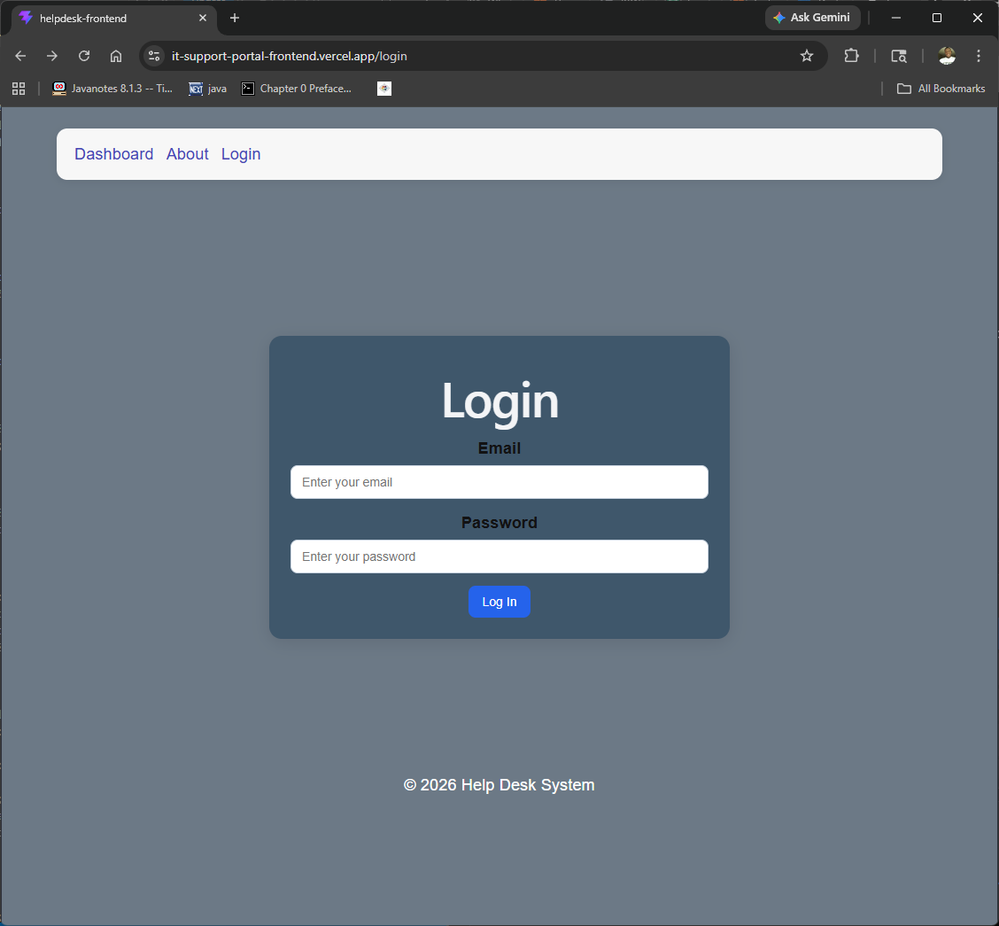
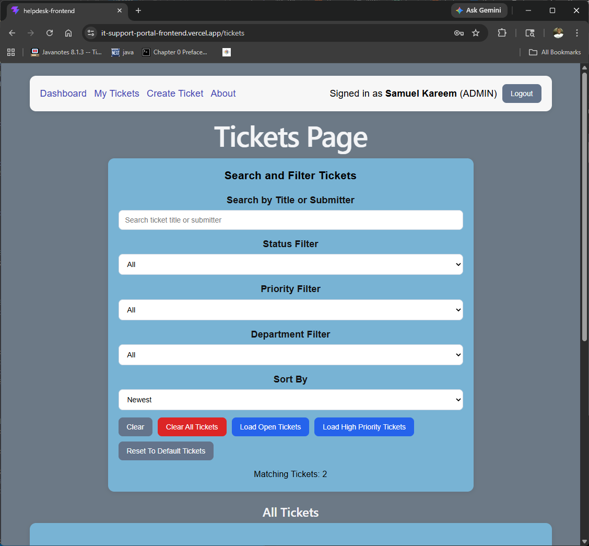
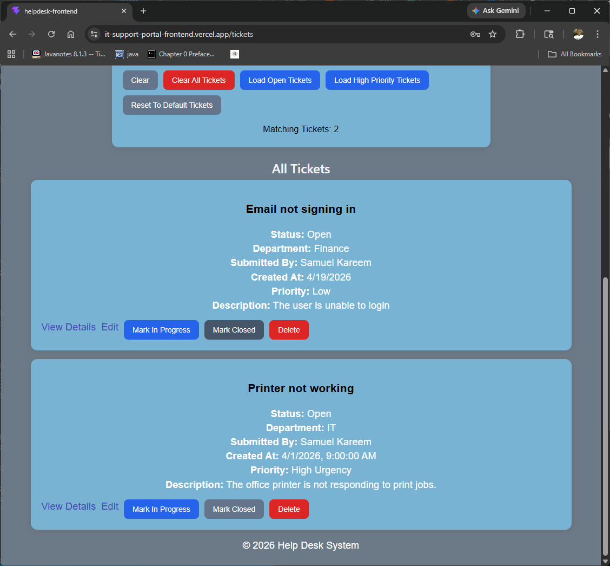
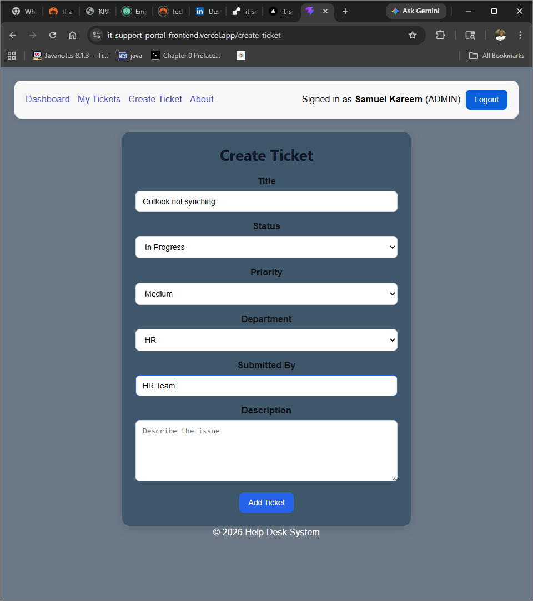
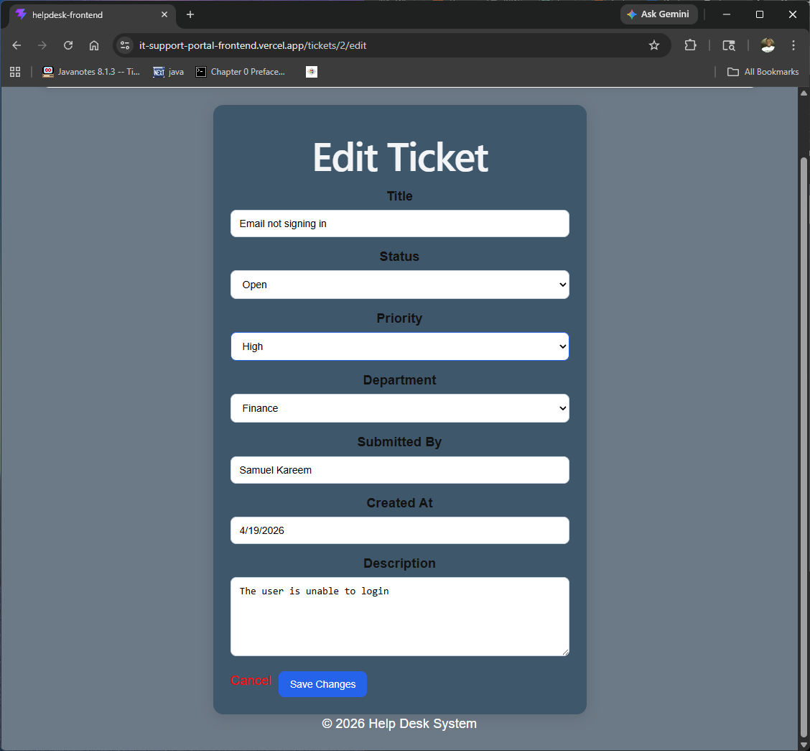
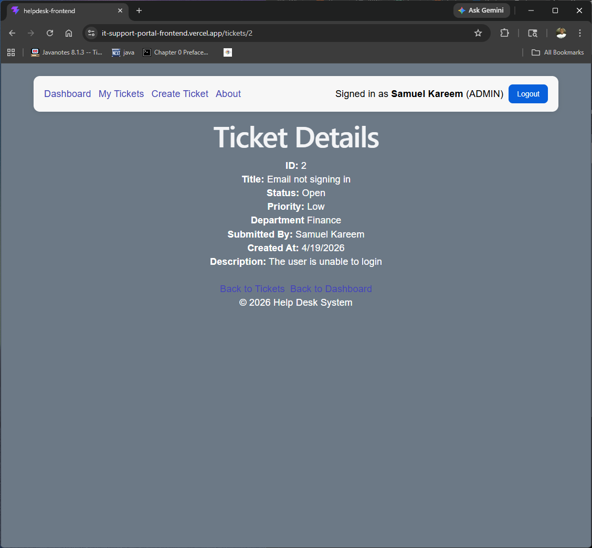

# IT Support Portal

## Overview
IT Support Portal is a full-stack help desk ticketing system built with React, Spring Boot, and PostgreSQL. It allows users to log in, create tickets, edit tickets, filter and search tickets, and manage ticket status through a deployed frontend connected to a REST API backend.

This project was built to simulate a real internal support workflow and demonstrate practical full-stack software engineering skills, including frontend-backend integration, authentication basics, role-based UI behavior, database persistence, and cloud deployment.

## Live Demo
- Frontend: https://it-support-portal-frontend.vercel.app
- Backend API sample endpoint: https://it-support-portal-backend.onrender.com/api/tickets

## Features
- User login
- Role-aware UI for Admin, Agent, and Employee users
- Create support tickets
- View all tickets
- Search tickets by title or submitter
- Filter tickets by status, priority, and department
- Sort tickets by newest, oldest, and title
- View ticket details
- Edit existing tickets
- Mark tickets as in progress or closed
- Delete tickets
- Dashboard summary with ticket counts
- PostgreSQL persistence
- Password hashing with BCrypt
- Protected frontend routes
- Deployed full-stack architecture

## Tech Stack

### Frontend
- React
- Vite
- React Router
- JavaScript
- Custom CSS

### Backend
- Java
- Spring Boot
- Spring Web
- Spring Data JPA
- Spring Validation
- Spring Security Crypto (BCrypt)

### Database
- PostgreSQL
- Neon

### Deployment
- Vercel
- Render
- Neon

## Project Structure
```text
IT-Support-Portal/
  helpdesk-frontend/
  helpdesk-backend/
  ```


# How The Application Works
The React frontend provides the user interface for authentication and ticket management. It communicates with a Spring Boot REST API. The backend handles ticket operations, authentication logic, validation, and database access through Spring Data JPA. PostgreSQL stores the application data, and the full stack is deployed using Vercel, Render, and Neon.

## Main Features
### Authentication
Users can log in through the frontend. The backend validates credentials and uses hashed passwords for safer authentication handling.

## Dashboard
The dashboard shows ticket summary counts, including total tickets, open tickets, in-progress tickets, closed tickets, and priority breakdowns.

## Tickets Page
Users can search, filter, sort, and browse ticket records. Authorized roles can update ticket status, edit ticket details, or delete tickets.

## Create Ticket
Users can create new support tickets through a validated form connected to the backend.

## Edit Ticket
Authorized users can update existing ticket information, including title, status, priority, department, submitter, and description.

## Ticket Details
Each ticket has a dedicated details page showing the full ticket record.

## Role Behavior
- ADMIN: can manage tickets, including edit, close, and delete actions
- AGENT: can manage tickets, including edit, close, and delete actions
- EMPLOYEE: can view and create tickets, but cannot perform management actions

## Screenshots

### Login Page


### Dashboard


### Tickets Page



### Create Ticket


### Edit Ticket


### Ticket Details
